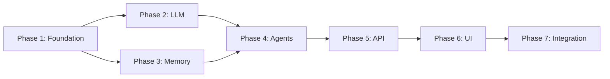

# ProjectPilot - Iteration 1

**Version:** 1.0
**Last Updated:** 18-Dec-2025
**Goal:** Minimum Viable Product (MVP)

---

## Iteration Overview

Iteration 1 focuses on building a functional MVP that demonstrates the core multi-agent architecture with basic planning, research, and reporting capabilities. By the end of this iteration, users should be able to interact with ProjectPilot through a web chat interface and receive intelligent responses from coordinated AI agents.

---

## Goals

1. **Establish Foundation:** Set up the project structure, CI/CD, and deployment infrastructure
2. **Multi-Agent Core:** Implement orchestrator and three specialized agents using AutoGen.Net
3. **Dual LLM Support:** Enable both Azure OpenAI and Google Gemini as selectable providers
4. **Basic Memory:** Implement short-term (session) and long-term (persistent) memory
5. **Web Interface:** Create a functional chat UI with streaming responses
6. **Cloud Deployment:** Deploy to Azure Container Apps with scale-to-zero

---

## Success Criteria

| Criteria | Measurement |
|----------|-------------|
| Agents respond to queries | All four agents functional |
| LLM providers work | Both Azure OpenAI and Gemini tested |
| Memory persists | Context maintained across conversations |
| UI is usable | Users can chat and see agent responses |
| Scales to zero | No cost when idle |
| Deploys automatically | GitHub Actions pipeline works |

---

## Deliverables

### D1: Project Foundation
- [x] Solution structure with all projects
- [x] GitHub repository with branch protection
- [x] README with setup instructions
- [x] Development environment configuration
- [x] .gitignore and .editorconfig

### D2: Infrastructure Setup
- [x] Docker configuration (Dockerfile, docker-compose)
- [x] Azure Container Apps Bicep templates
- [x] Azure Cache for Redis provisioning
- [x] Azure Cosmos DB provisioning
- [x] Azure Key Vault setup
- [x] GitHub Actions CI/CD pipeline

### D3: LLM Abstraction Layer
- [x] `ILLMProvider` interface
- [x] `AzureOpenAIProvider` implementation
- [x] `GeminiProvider` implementation
- [x] `LLMProviderFactory` for DI
- [x] Provider configuration and selection
- [x] Streaming response support

### D4: Agent Implementation
- [x] Base agent infrastructure with AutoGen.Net
- [x] Orchestrator Agent (routes requests)
- [x] Planning Agent (task breakdown)
- [x] Research Agent (web search, docs)
- [x] Reporting Agent (summaries)
- [x] Agent communication protocols

### D5: Memory System
- [x] `IMemoryStore` interface
- [x] Redis short-term memory implementation
- [x] Cosmos DB long-term memory implementation
- [x] Memory retrieval and storage APIs
- [x] Conversation context management

### D6: Backend API
- [x] ASP.NET Core Minimal API project
- [x] Chat endpoint with streaming (SSE)
- [x] Health check endpoints
- [x] Configuration endpoints
- [x] CORS and security middleware

### D7: Frontend UI
- [x] Blazor WebAssembly project
- [x] MudBlazor component library setup
- [x] Chat interface component
- [x] Streaming response display
- [x] Agent activity indicators
- [x] Provider selection UI
- [x] Basic responsive layout

### D8: Documentation
- [x] API documentation (Swagger)
- [x] Local development guide
- [x] Deployment guide
- [x] Architecture overview

---

## Solution Structure

```
ProjectPilot/
├── .github/
│   └── workflows/
│       ├── ci.yml
│       └── deploy.yml
├── docs/
│   ├── product-requirements.md
│   ├── features-list.md
│   └── iteration-1.md
├── infra/
│   ├── main.bicep
│   ├── modules/
│   │   ├── container-apps.bicep
│   │   ├── cosmos-db.bicep
│   │   ├── redis.bicep
│   │   └── keyvault.bicep
│   └── parameters/
│       ├── dev.bicepparam
│       └── prod.bicepparam
├── src/
│   ├── ProjectPilot.Agents/
│   │   ├── Agents/
│   │   │   ├── OrchestratorAgent.cs
│   │   │   ├── PlanningAgent.cs
│   │   │   ├── ResearchAgent.cs
│   │   │   └── ReportingAgent.cs
│   │   ├── Contracts/
│   │   │   ├── IAgent.cs
│   │   │   └── AgentMessage.cs
│   │   └── ProjectPilot.Agents.csproj
│   ├── ProjectPilot.LLM/
│   │   ├── Providers/
│   │   │   ├── ILLMProvider.cs
│   │   │   ├── AzureOpenAIProvider.cs
│   │   │   └── GeminiProvider.cs
│   │   ├── Models/
│   │   │   ├── ChatRequest.cs
│   │   │   └── ChatResponse.cs
│   │   ├── LLMProviderFactory.cs
│   │   └── ProjectPilot.LLM.csproj
│   ├── ProjectPilot.Memory/
│   │   ├── Stores/
│   │   │   ├── IMemoryStore.cs
│   │   │   ├── RedisMemoryStore.cs
│   │   │   └── CosmosMemoryStore.cs
│   │   ├── Models/
│   │   │   └── MemoryEntry.cs
│   │   └── ProjectPilot.Memory.csproj
│   ├── ProjectPilot.Api/
│   │   ├── Endpoints/
│   │   │   ├── ChatEndpoints.cs
│   │   │   ├── HealthEndpoints.cs
│   │   │   └── ConfigEndpoints.cs
│   │   ├── Middleware/
│   │   ├── Program.cs
│   │   ├── appsettings.json
│   │   └── ProjectPilot.Api.csproj
│   └── ProjectPilot.Web/
│       ├── Components/
│       │   ├── Chat/
│       │   │   ├── ChatContainer.razor
│       │   │   ├── ChatMessage.razor
│       │   │   └── ChatInput.razor
│       │   ├── Layout/
│       │   │   ├── MainLayout.razor
│       │   │   └── NavMenu.razor
│       │   └── Settings/
│       │       └── ProviderSettings.razor
│       ├── Services/
│       │   └── ChatService.cs
│       ├── wwwroot/
│       ├── Program.cs
│       └── ProjectPilot.Web.csproj
├── tests/
│   ├── ProjectPilot.Agents.Tests/
│   ├── ProjectPilot.LLM.Tests/
│   ├── ProjectPilot.Memory.Tests/
│   └── ProjectPilot.Api.Tests/
├── docker-compose.yml
├── Dockerfile
├── ProjectPilot.sln
├── README.md
├── LICENSE
└── .gitignore
```

---

## Implementation Tasks

### Phase 1: Foundation (Tasks 1-10)

| # | Task | Est. Complexity |
|---|------|-----------------|
| 1 | Create solution and project structure | Low |
| 2 | Set up GitHub repository | Low |
| 3 | Configure .NET projects and dependencies | Medium |
| 4 | Create Dockerfile and docker-compose.yml | Medium |
| 5 | Set up local development environment | Low |
| 6 | Create Azure resource group and Key Vault | Low |
| 7 | Write Bicep templates for infrastructure | High |
| 8 | Configure GitHub Actions CI pipeline | Medium |
| 9 | Configure GitHub Actions CD pipeline | Medium |
| 10 | Set up Azure Container Apps environment | Medium |

### Phase 2: LLM Integration (Tasks 11-17)

| # | Task | Est. Complexity |
|---|------|-----------------|
| 11 | Define ILLMProvider interface | Low |
| 12 | Implement AzureOpenAIProvider | Medium |
| 13 | Implement GeminiProvider | Medium |
| 14 | Create LLMProviderFactory | Low |
| 15 | Add streaming support to providers | High |
| 16 | Write provider configuration | Low |
| 17 | Write unit tests for providers | Medium |

### Phase 3: Memory System (Tasks 18-24)

| # | Task | Est. Complexity |
|---|------|-----------------|
| 18 | Define IMemoryStore interface | Low |
| 19 | Implement RedisMemoryStore | Medium |
| 20 | Implement CosmosMemoryStore | Medium |
| 21 | Create memory models and DTOs | Low |
| 22 | Add conversation context manager | Medium |
| 23 | Write memory retrieval logic | Medium |
| 24 | Write unit tests for memory stores | Medium |

### Phase 4: Agent Implementation (Tasks 25-33)

| # | Task | Est. Complexity |
|---|------|-----------------|
| 25 | Set up AutoGen.Net framework | Medium |
| 26 | Define agent base classes and interfaces | Medium |
| 27 | Implement OrchestratorAgent | High |
| 28 | Implement PlanningAgent | High |
| 29 | Implement ResearchAgent | High |
| 30 | Implement ReportingAgent | High |
| 31 | Create agent communication protocol | Medium |
| 32 | Integrate agents with memory system | Medium |
| 33 | Write unit tests for agents | High |

### Phase 5: Backend API (Tasks 34-40)

| # | Task | Est. Complexity |
|---|------|-----------------|
| 34 | Create ASP.NET Core Minimal API project | Low |
| 35 | Implement chat endpoint with SSE streaming | High |
| 36 | Add health check endpoints | Low |
| 37 | Add configuration endpoints | Low |
| 38 | Configure dependency injection | Medium |
| 39 | Add middleware (CORS, error handling) | Medium |
| 40 | Write API integration tests | Medium |

### Phase 6: Frontend UI (Tasks 41-50)

| # | Task | Est. Complexity |
|---|------|-----------------|
| 41 | Create Blazor WebAssembly project | Low |
| 42 | Install and configure MudBlazor | Low |
| 43 | Create main layout and navigation | Medium |
| 44 | Implement ChatContainer component | High |
| 45 | Implement ChatMessage component | Medium |
| 46 | Implement ChatInput component | Medium |
| 47 | Add streaming response handling | High |
| 48 | Create agent activity indicators | Medium |
| 49 | Implement ProviderSettings component | Medium |
| 50 | Add responsive styling | Medium |

### Phase 7: Integration & Testing (Tasks 51-55)

| # | Task | Est. Complexity |
|---|------|-----------------|
| 51 | End-to-end integration testing | High |
| 52 | Performance testing | Medium |
| 53 | Security review | Medium |
| 54 | Bug fixes and polish | Medium |
| 55 | Documentation completion | Medium |

---

## Dependencies



---

## Technical Decisions

### Decision 1: AutoGen.Net vs Custom Framework
**Decision:** Use AutoGen.Net
**Rationale:** Provides proven multi-agent orchestration, reduces development effort, Microsoft-supported

### Decision 2: Blazor WebAssembly vs Server
**Decision:** Use Blazor WebAssembly
**Rationale:** Better scale-to-zero support (static files), reduced server load, offline potential

### Decision 3: Minimal APIs vs Controllers
**Decision:** Use Minimal APIs
**Rationale:** Lighter weight, better performance, cleaner code, modern approach

### Decision 4: Redis vs In-Memory for Short-term
**Decision:** Use Redis
**Rationale:** Supports scale-out, persistence across restarts, Azure managed service available

### Decision 5: Cosmos DB vs PostgreSQL for Long-term
**Decision:** Use Cosmos DB
**Rationale:** Serverless tier supports scale-to-zero, flexible schema for memories, global distribution

---

## Configuration

### Local Development (appsettings.Development.json)

```json
{
  "LLMProvider": "Gemini",
  "Gemini": {
    "ApiKey": "your-api-key",
    "Model": "gemini-1.5-flash"
  },
  "AzureOpenAI": {
    "Endpoint": "https://your-instance.openai.azure.com/",
    "ApiKey": "your-api-key",
    "DeploymentName": "gpt-4o"
  },
  "Redis": {
    "ConnectionString": "localhost:6379"
  },
  "CosmosDb": {
    "Endpoint": "https://localhost:8081",
    "Key": "your-key",
    "DatabaseName": "ProjectPilot"
  }
}
```

---

## Risks for Iteration 1

| Risk | Likelihood | Impact | Mitigation |
|------|------------|--------|------------|
| AutoGen.Net learning curve | Medium | Medium | Allocate time for research, use examples |
| Gemini API rate limits | Low | Low | Implement retry logic, use Azure OpenAI fallback |
| Scale-to-zero cold starts | Medium | Low | Optimize startup time, use warm-up requests |
| Blazor WASM performance | Low | Medium | Lazy loading, optimize bundle size |

---

## Exit Criteria

Iteration 1 is complete when:

- [ ] All P0 features from features-list.md are implemented
- [ ] Application deploys successfully to Azure Container Apps
- [ ] All four agents respond correctly to test queries
- [ ] Both LLM providers work correctly
- [ ] Memory persists across sessions
- [ ] UI is functional and responsive
- [ ] CI/CD pipeline is operational
- [ ] Basic documentation is available
- [ ] No critical bugs remain

---

## Next Steps (Iteration 2 Preview)

- Enhanced agent capabilities (more tools)
- User authentication
- Project management features
- Task persistence and tracking
- Advanced memory (semantic search)
- UI improvements (dark mode, task board)
